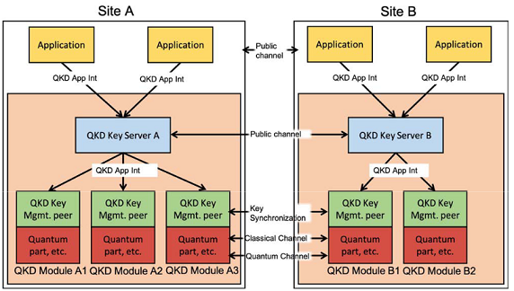

# qkd-module

This repo contains the source code needed to run a QKD Module instance. By referring to ETSI standard architecture the code in this folder refers to the squared box containing the green and red boxes:



The _QKD Key Management peer_ in the image is implemented in `QKDModule.py` file and implements the standard API to request a key. The _Quantum part_ box is here represented by a simulator of a QKD exchange. It can be one between `BB84.py` and `fakeKE.py` (this can be chosen in settings) in order to simulate an exchange with BB84 protocol or a dummy (and quicker) exchange of randomly generated keys.

The imame shows that this QKD module should be used within a __QKD Key Server__. Here the step needed to achieve the depicted configuration will be provided. However, QKD module can also be used directly by a final application by calling its methods. In either cases the modules it leans on must be up and running before launching this code (see [prerequisites](#prerequisites) section for further information).

## Prerequisites
If you plan to use QKD Module within a QKD Key server you can skip this part since QKD Key server is in charge of correctly configure the whole system before running.

If you plan to use QKD Module directly with a final applicaiton you need to make sure all the needed module are correctly setup before launching the code. QKD Module leans on two main services:
- Vault
- Mysql
Both of these services must be configured and reachable from the module itself. For furher information about configuration of these services, refer to [QKD Key Server](https://github.com/ignaziopedone/qkd-keyserver) repository's README.

After configuring mysql make sure the following tables are available inside your DB:
```
CREATE TABLE `handles` (
  `handle` varchar(255) NOT NULL,
  `destination` varchar(255) DEFAULT NULL,
  `timeout` int DEFAULT NULL,
  `length` int DEFAULT NULL,
  `synchronized` tinyint(1) NOT NULL,
  `newKey` tinyint(1) NOT NULL,
  `currentKeyNo` int DEFAULT 0,
  `stop` tinyint(1) DEFAULT 0,
  PRIMARY KEY (`handle`)
)


CREATE TABLE `bb` (
  `requestIP` varchar(255) NOT NULL,
  `complete` tinyint(1) DEFAULT NULL,
  `exchangedKey` text,
  `verified` tinyint(1) DEFAULT NULL,
  PRIMARY KEY (`requestIP`)
)
```

## Configuration
Before starting the code, it is needed to manage the configuration phase, which basically consists of modifying the configuration file `configM.yaml` accordingly to your current settings.

By opening _configM.yaml_ file it is possible to see different sections that need to be configured:

- internal_db: This section contains the references to the mysql service needed by the QKD Module. All the related settings must be changed accordingly to your mysql settings (I guess the single fields are self-explainatory, but if you need a detailed description ask Dr. Pedone - he is available during night).

- vault: It contains IP address and port to access vault storage. It is also needed to indicate the root token to access the service. Refers to vault service configuration in [QKD Key Server](https://github.com/ignaziopedone/qkd-keyserver) repository's README for more information.

- module: It contains the specific module settings:
	- table: it is the name of the mysql table in which QKD Module will store its data. If you use Key server configuration (or you copied the configuration in the previous paragraph), you can keep `handles` as entry. If you change name to this table, remember that it must contains the same fields already described in [prerequisites](#prerequisites) section.
	- sender: it represents the role of the current QKD Module. Its vaules can be `1` if the current QKD Module should behave as QKD source or `0` if the module should behave as QKD detector. Remember to configure two QKD Module peers alternatively (one as source and one as destination) in order to have a correct key exchange.
	- sim: it allows to select the kind of simulator to use. Its vaules can be `fake` if you want to use the fake key exchange protocol or `bb84` if you want to use BB84 simulator.
	- max_key_count: it is the maximum number of keys the QKD module can store simultaneously. Once a destination has been configured, the module will start the key exchange until the number of keys here indicated will be reached.

- simulator: This section contains the settings for `BB84` simulator. It will not be used if fake protocol is chosen. It consists of the following fields:
	- table: it is the name of the mysql table simulator will use to store its data. If you use Key server configuration (or you copied the configuration in the previous paragraph), you can keep `bb` as entry. If you change name to this table, remember that it must contains the same fields already described in [prerequisites](#prerequisites) section.
	- eve: this parameter is experimental and it is not currently working. Its aim is to activate the presence of an adversary that may interfere with the communication.
	- private_key: this parameter (and the following) is part of the `SPHINCS+` asymmetric key pair used for authentication purpose on the classical channel. This parameter represents the private key of the pair.
	- public_key: this is the `SPHINCS+` public key (see above).

## API
QKD Module is composed by a set of API defined by QKD standard _ETSI GS QKD 004 v2.1.1 (2020-8)_ implemented as REST API. The API are the following:

- POST http://moduleIP/open_connect
This function reserves an association (Key_stream_ID) between this module and a specified destination. Required parameter is an array containing the following values:
	- `source` - the IP address of the source requiring the association (this parameter is required by the standard but it is unused).
	- `destination` - the IP address of the QKD Module peer to exchange keys with.
	- `qos` - the quality of service the two QKD modules must fulfil. The only parameters considered in this implementation are length (in bits) and timeout (in milliseconds)
	- `Key_stream_ID` - unique handle to identify the stream ID. This parameter can be `None` and the module will generate and assigne a unique handle to the stream ID that it will going to generate, or it can be a stream ID retrieved from the peer high level application that has been returned from the peer QKD module calling the same function.
The function will synchronize with the peer QKD Module to start the keys exchange and will return the assigned Key_stream_ID (the same passed as input if the parameter was not `NULL`) and a status variable that can take values `0` (SUCCESSFUL) or `2` (NO_QKD_CONNECTION_AVAILABLE).
Example usage in python3 in which Key_stream_ID is `None`:
```
import requests
qos = {'timeout' : 5000, 'length' : 128} 
x = requests.post('http://127.0.0.1:5000/open_connect', data=repr([sourceAddress, moduleDestinationAddress, qos, None]))
if x.status_code == 200:
	response = eval(x.content)
	Key_stream_ID = response[0]
	status = response[1]
```

- POST http://moduleIP/close
Closes the association represented by Key_stream_ID and stops the key exchange. The already exchanged keys are however available to be retrieved.
Required parameter is an array containing just one element: the Key_stream_ID.
Example usage in python3:
```
import requests
x = requests.post('http://127.0.0.1:5000/close', data=repr([Key_stream_ID]))
```

- POST http://moduleIP/get_key
This function can be used to retrieve a key belonging to the specified Key_stream_ID.
Required parameter is an array containing the following values:
	- `Key_stream_ID` - the same handle returned by OPEN_CONNECT method.
	- `index` - a specific index in the stream. If `-1` the first available key in the stream will be returned.
	- `Metadata` - a parameter required by the standard but currently unused.
The function will return the requested key, the index of the key within the stream and a status variable that can take value `0` (SUCCESS), or `1` (INSUFFICIENT_KEY_AVAILABLE)
Example usage in python3:
```
import requests
x = requests.post('http://127.0.0.1:5000/get_key', data=repr([Key_stream_ID, -1, None]))
if x.status_code == 200:
	response = eval(x.content)
	key = response[0]
	index = response[1]
	status = response[2]
```

- POST http://moduleIP/available_keys
This function is NOT part of the ETSI standard. It has been designed to be used from QKD Key Server in order to get information about the number of currently available keys in the module. This information should be returned by the key server, but it has not been foreseen in the module in the current standard.
The function returns an array with just one element representing the number of currently available keys.
Exemple usage in python3:
```
import requests
x = requests.post('http://127.0.0.1:5000/available_keys')
if x.status_code == 200:
	availableKeys = int(eval(x.content)[0])
```

### Synchronization API
Besides the API already described, two more methods have been defined. These methods are used to synchronize the key exchange between the two QKD modules. ETSI standard does not define the way the two QKD modules should communicate each other, hence the following methods do not follow any standard but are defined only for convenience.
These methods should never be called by high level application. They are for the soley use of the module itself and are reported here only for reference.

- GET http://moduleIP/sync
This method is used to synchronize Key_stream_ID during a call to OPEN_CONNECT method. The method takes as query parameter the Key_stream_ID so that the peer QKD Module can saves it in its database. When the peer high level application will call OPEN_CONNECT function with the same Key_stream_ID the module will find this ID in its database and the connection will be established.

- POST http://moduleIP/start
This method is used during key exchange. Sender uses this function to signal that the lower level simulator has completed a key exchange and the peer module can retrieve the related key. Receiver uses this method to signal sender it has retrieved the key from the lower level simulator and a new key exchange can be started.


## Notes.
QKD Module uses `http` protocol that is insecure. Sniffing information in the communication between two QKD Modules do not impact on the overall security: data exchanged do not contain information about keys exchanged in any way. However, the standard API should be secured since the keys themselves pass through that connection.
A proposal of improvement can be to use part of the keys exchanges from the simulator as preshared key in order to implement TLS-PSK o other protocols that can ensure a secure data exchange.
