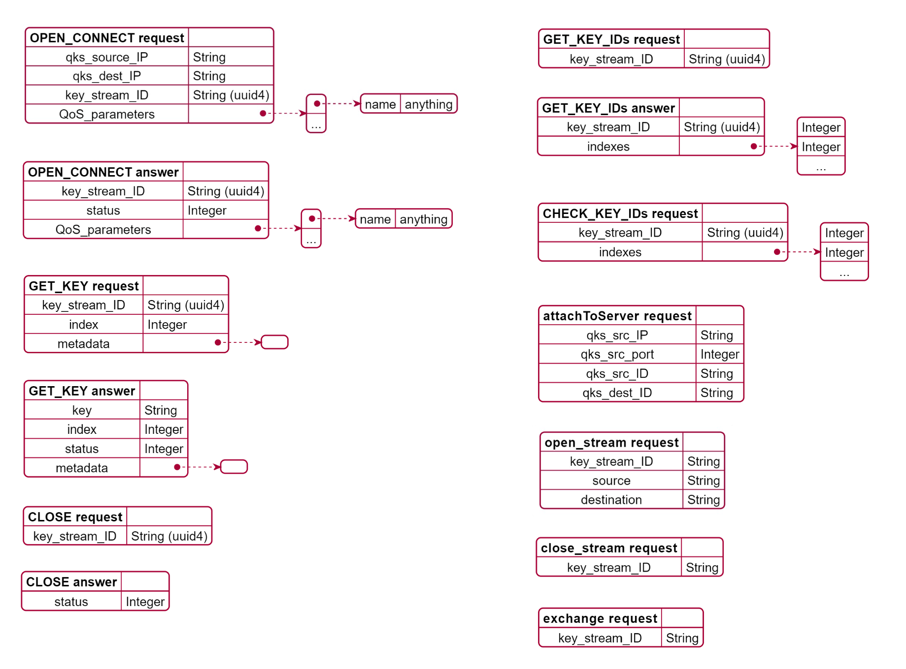

# QKD MODULE APIs
## Southbound interface : QKS to QKD Module
| method                | path  | action| note  | 
|-------                | ----  | ------| ----  |
| **open_connect**      | /api/v1/qkdm/actions/open_connect                 | POST  |       |
| **close**             | /api/v1/qkdm/actions/close                        | POST  |       |
| **get_key**           | /api/v1/qkdm/actions/get_key                      | POST  |       |
| get_key_ids           | /api/v1/qkdm/actions/get_ID/*<key_stream_ID>*?count=*<count>*    | GET   |       |
| check_id              | /api/v1/qkdm/actions/check_ID                     | POST  |       |
| attach_to_server      | /api/v1/qkdm/actions/attach                       | POST  |       |

## QKD Module to QKD Module interface
| method                | path  | action| note  | 
|-------                | ----  | ------| ----  |
| open_stream           | /api/v1/qkdm/actions/open_stream      | POST  |       |
| exchange              | /api/v1/qkdm/actions/exchange         | POST  |       |

## JSONs format 

## PLANTUML CODE
## QKD MODULE

@startjson
{
    "**CLOSE answer**":"",
    "status" : "Integer"
}
@endjson

@startjson
{
    "**CLOSE request**":"",
    "key_stream_ID" : "String (uuid4)"
}
@endjson

@startjson
{
    "**OPEN_CONNECT request**":"",
    "qks_source_IP": "String", 
    "qks_dest_IP" : "String", 
    "key_stream_ID" : "String (uuid4)",
    "QoS_parameters" : [
        {"name" : "anything"},
        "..."
    ]
}
@endjson

@startjson
{
    "**OPEN_CONNECT answer**":"",
    "key_stream_ID" : "String (uuid4)",
    "status" : "Integer",
    "QoS_parameters" : [
        {"name" : "anything"},
        "..."
    ]
    
}
@endjson

@startjson
{
    "**GET_KEY request**":"",
    "key_stream_ID" : "String (uuid4)",
    "indexes" : ["Integer", "..."] ,
    "metadata" : {}
    
}
@endjson

@startjson
{
    "**GET_KEY answer**":"",
    "keys" : ["Integer", "..."],
    "indexes" : ["Integer", "..."],
    "status" : "Integer",
    "metadata" : {}
    
}
@endjson

@startjson
{
    "**GET_KEY_IDs request**":"",
    "key_stream_ID" : "String (uuid4)"
}
@endjson

@startjson
{
    "**GET_KEY_IDs answer**":"",
    "key_stream_ID" : "String (uuid4)",
    "indexes" : ["Integer", "Integer", "..."] 
}
@endjson

@startjson
{
    "**CHECK_KEY_IDs request**":"",
    "key_stream_ID" : "String (uuid4)",
    "indexes" : ["Integer", "Integer", "..."] 
}
@endjson

@startjson
{
    "**attachToServer request**":"",
    "qks_src_IP" : "String",
    "qks_src_port" : "Integer",
    "qks_src_ID" : "String",
    "qks_dest_ID" : "String"
}
@endjson

@startjson
{
    "**open_stream request**":"",
    "key_stream_ID" : "String", 
    "source" : "String", 
    "destination" : "String"
}
@endjson

@startjson
{
    "**exchange request**":"",
    "key_stream_ID" : "String"
}
@endjson
