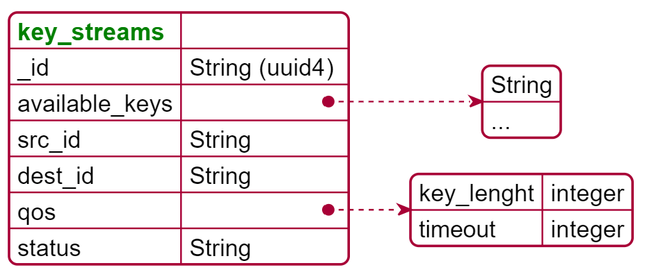

# DB model 

## MongoDB view 

# PlantUML JSON Codes
@startjson
#highlight "_id" 
{
"<color:green>**key_streams**" : "", 
  	"_id": "String (uuid4) ", 
	"available_keys" : ["String", "..."], 
	"src_id" : "String", 
	"dest_id" : "String", 
	"qos" : {
		"key_lenght" : "integer",
		"timeout" : "integer",
		"parameter" : "anything"
	}, 
	"status" : "String" 
}
@endjson